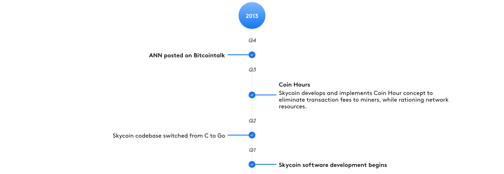
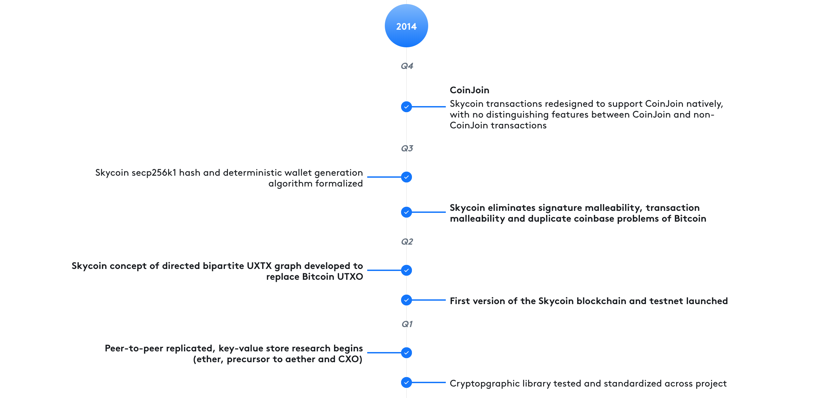
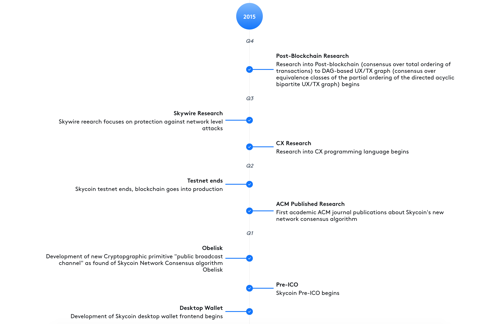
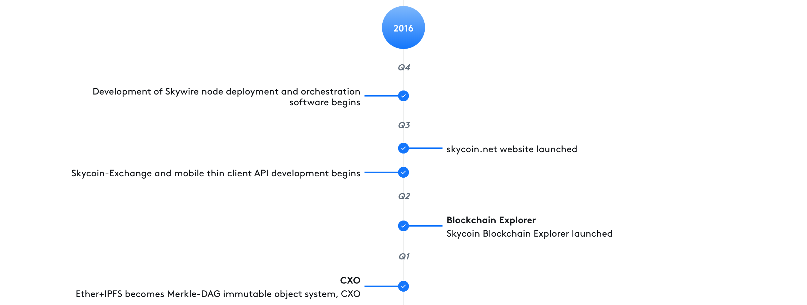
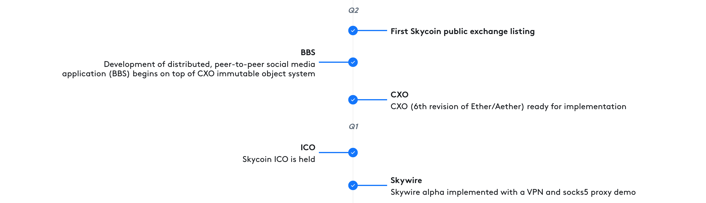
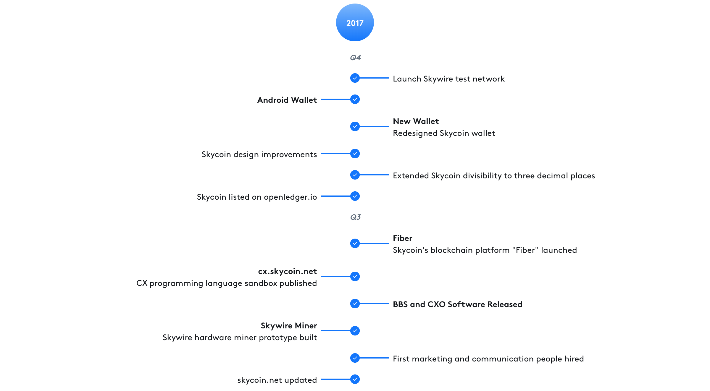
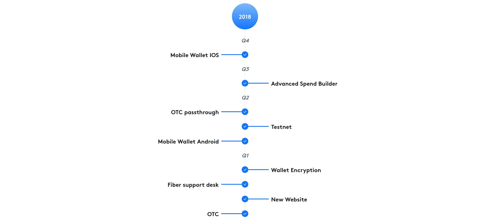
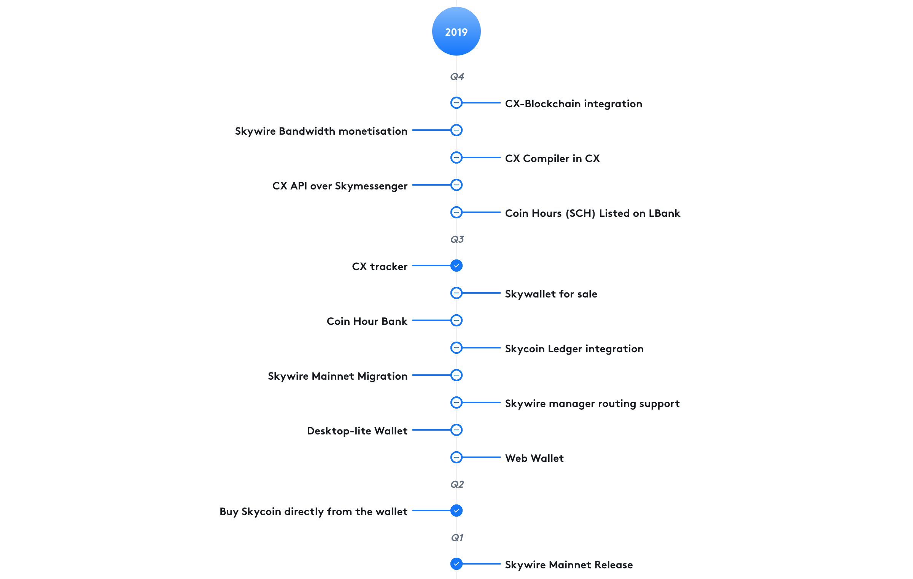

# Skycoin 
## Project Overview

---
# Skycoin
## Development Roadmap 

--
# Skycoin
## Development Roadmap 2011 - 2012

--
# Skycoin
## Development Roadmap 2012 - 2013

--
# Skycoin
## Development Roadmap  2013 - 2014

--
# Skycoin
## Development Roadmap  2014 - 2015

--
# Skycoin
## Development Roadmap  2015 - 2016

--
# Skycoin
## Development Roadmap  2016 - 2017
### Q1 & Q2

--
# Skycoin
## Development Roadmap  2016 - 2017
### Q3 & Q4

--
# Skycoin
## Development Roadmap  2017 - 2018

--
# Skycoin
## Development Roadmap  2018 - 2019

--
# Skycoin
## Development Roadmap  2019 - 2020

---

# The Decentralised World Is Coming

Are you going to help build it?
Or just live in it?

---
# Blockchain Benefits

## Peer-to-Peer
No more middle men. 

You deal directly with the people you need to.

## Transparent
The history of the blockchain is public and can be audited by anyone to determine 'bad actors`.

## Decentralised
No central authority is in control of a Blockchain. 

None of this "Don't be Evil" BS...  Evil isn't an option.

---

# Blockchain Problems

## Scalability
Ridiculous operating costs, transaction fees and associated difficulties hinder most projects.

## Speed
If your 'solution' can only handle a handful of people using it globally... it's not viable.

## Security
Many flaws have surfaced with the two main consensus algorithms - PoW and PoS

---
# Enter Skycoin
## A New Vision

> Fulfil Satoshi's vision of a global electronic, peer-to-peer digital currency.

Born out of necessity, Skycoin started with a simple vision that has gradually expanded and evolved. 

It now includes a complete decentralised economy and a general purpose programming language, CX, which supports integration with the blockchain.s

---
# Skycoin Project Snapshot
- 8 Years old
- 100+ Employees
- 60+ Developers
- 10k+ Volunteers (the Skyfleet)

---
# Skyfleet
## The Skycoin Global Community

---
# Skycoin Ecosystem
## Fiber

## Skycoin

## Obelisk

---
# Skycoin Ecosystem
## Skywire

## CX

## CXO

